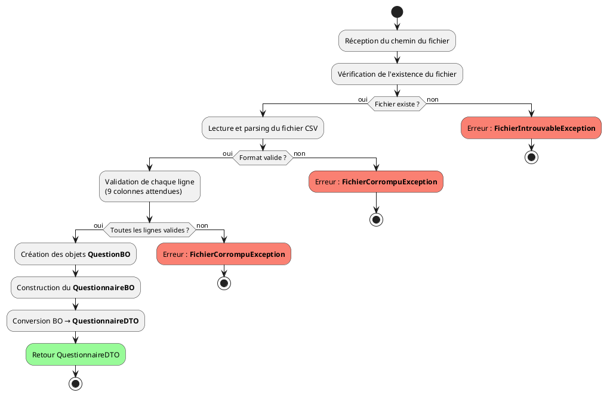
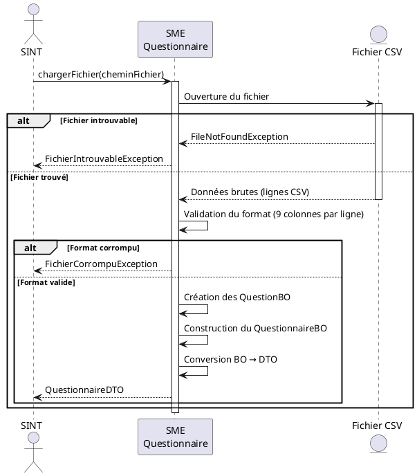

# CLAUDE.md — Contexte projet SME Questionnaire (Jeu du Quizz)

## 1. Vue d'ensemble du projet

Ce projet est un **jeu de quizz en Java** développé dans le cadre du cours R04.02 (Qualité de développement) en BUT Informatique 2ème année à l'IUT de Montreuil. C'est un projet Maven structuré en couches.

### Organisation en équipe (6 personnes, 3 binômes)

| Binôme | Système | Repo GitHub | Responsabilité |
|--------|---------|-------------|----------------|
| Binôme 1 | **SME Questionnaire** (c'est nous) | `questionnaire-sme` | Chargement CSV, gestion questions, stats questionnaire |
| Binôme 2 | SME Joueur | `joueur-sme` | Gestion joueurs, scores, classement |
| Binôme 3 | SINT + SAPP | `sint` | Intégration des 2 SME + interface console |

**NOUS SOMMES LE BINÔME SME QUESTIONNAIRE.** On ne code PAS les joueurs, PAS l'interface console, PAS l'intégration.

### Artefact Maven

```
groupid: org.univ_paris8.iut.montreuil.qdev.tp202x.grX.jeuQuizz
artifactid: questionnaire_sme
version: 1.0.0-SNAPSHOT
Archetype: maven-archetype-quickstart 1.5
```

### Structure des packages (OBLIGATOIRE — imposée par le DAT)

```
src/
├── main/java/
│   └── fr/iut/montreuil/R4_S02_2023/prof/questionnaire_sme/
│       ├── entities/           ← Interfaces des entités
│       ├── entities/bo/        ← Business Objects (objets internes)
│       ├── entities/dto/       ← Data Transfer Objects (exposés au SINT)
│       ├── impl/               ← Implémentations des services
│       ├── modeles/            ← Classes modèle / utilitaires
│       └── resources/          ← Chargement fichier CSV
└── test/java/
    └── fr/iut/montreuil/R4_S02_2023/prof/questionnaire_sme/
        ├── impl/               ← Tests unitaires des services
        └── resources/          ← Tests de chargement fichier
```

**IMPORTANT :** Le fichier `questionsQuizz_V1.csv` doit être placé dans `src/main/resources/`.

---

## 2. Fichier CSV en entrée

**Nom :** `questionsQuizz_Vxxxx.csv`  
**Pas de ligne d'en-tête.**  
**Séparateur :** tabulation (à vérifier, potentiellement `;`)  
**9 colonnes par ligne :**

| # | Colonne | Type | Exemple |
|---|---------|------|---------|
| 1 | id questionnaire | int | 1 |
| 2 | libellé questionnaire | String | Sport niv 1 |
| 3 | num question | int | 1 |
| 4 | langue | String | fr |
| 5 | libellé question | String | De quel petit objet se munit le golfeur... |
| 6 | réponse | String | Tee |
| 7 | difficulté | int | 1 (Simple), 2 (Intermédiaire), 3 (Expert) |
| 8 | explication | String | Le joueur peut poser sa balle... |
| 9 | référence | String | https://fr.wikipedia.org/wiki/... |

---

## 3. Objets métier

### 3.1. QuestionBO (Business Object — interne, PAS exposé au SINT)

```java
package fr.iut.montreuil.R4_S02_2023.prof.questionnaire_sme.entities.bo;

public class QuestionBO {
    private int idQuestionnaire;
    private int numQuestion;
    private String libelleQuestion;
    private String reponse;
    private int difficulte;          // 1=Simple, 2=Intermédiaire, 3=Expert
    private String explication;
    private String reference;
    private int nbFoisPosee;         // stat : nombre de fois posée
    private int nbBonnesReponses;    // stat : nombre de bonnes réponses

    // Constructeurs, getters, setters
}
```

### 3.2. QuestionnaireBO (Business Object — interne)

```java
package fr.iut.montreuil.R4_S02_2023.prof.questionnaire_sme.entities.bo;

public class QuestionnaireBO {
    private int idQuestionnaire;
    private String libelleQuestionnaire;
    private String langue;
    private List<QuestionBO> questions;
    private int nbPartiesJouees;     // stat : nombre de parties jouées

    // Constructeurs, getters, setters
}
```

### 3.3. QuestionDTO (Data Transfer Object — exposé au SINT)

```java
package fr.iut.montreuil.R4_S02_2023.prof.questionnaire_sme.entities.dto;

public class QuestionDTO {
    private int idQuestionnaire;
    private int numQuestion;
    private String libelleQuestion;
    private String reponse;
    private int difficulte;
    private String explication;
    private String reference;
    // PAS de nbFoisPosee ni nbBonnesReponses (c'est interne au SME)

    // Constructeurs, getters, setters
}
```

### 3.4. QuestionnaireDTO (DTO — exposé au SINT)

```java
package fr.iut.montreuil.R4_S02_2023.prof.questionnaire_sme.entities.dto;

public class QuestionnaireDTO {
    private int idQuestionnaire;
    private String libelleQuestionnaire;
    private String langue;
    private List<QuestionDTO> questions;
    private int nbQuestionsSimples;
    private int nbQuestionsIntermediaires;
    private int nbQuestionsExpertes;

    // Constructeurs, getters, setters
}
```

### 3.5. StatistiqueQuestionnaireDTO (DTO — exposé au SINT)

```java
package fr.iut.montreuil.R4_S02_2023.prof.questionnaire_sme.entities.dto;

public class StatistiqueQuestionnaireDTO {
    private int idQuestionnaire;
    private int nbPartiesJouees;
    private QuestionDTO meilleureQuestion;
    private double tauxReussiteMeilleure;
    private QuestionDTO pireQuestion;
    private double tauxReussitePire;

    // Constructeurs, getters, setters
}
```

---

## 4. Exceptions métier

Toutes dans un package `exceptions` :

```java
public class FichierIntrouvableException extends Exception { ... }
public class FichierCorrompuException extends Exception { ... }
public class QuestionnaireIntrouvableException extends Exception { ... }
public class AucunQuestionnaireException extends Exception { ... }
public class DonneesInvalidesException extends Exception { ... }
public class AucunePartieJoueeException extends Exception { ... }
```

---

## 5. Services à implémenter (5 services)

### 5.1. chargerFichier

```
Signature : public QuestionnaireDTO chargerFichier(String cheminFichier)
              throws FichierIntrouvableException, FichierCorrompuException
```

**Logique :**
1. Vérifier que le fichier existe → sinon FichierIntrouvableException
2. Lire chaque ligne, splitter par le séparateur
3. Vérifier 9 colonnes par ligne → sinon FichierCorrompuException
4. Créer un QuestionBO par ligne
5. Regrouper par idQuestionnaire → créer QuestionnaireBO
6. Convertir en QuestionnaireDTO et retourner

**Diagramme d'activité :**


**Diagramme de séquence :**


### 5.2. fournirListeQuestionnaires

```
Signature : public List<QuestionnaireDTO> fournirListeQuestionnaires()
              throws AucunQuestionnaireException
```

**Logique :**
1. Vérifier que des questionnaires sont chargés → sinon AucunQuestionnaireException
2. Pour chaque QuestionnaireBO : compter questions par difficulté
3. Convertir chaque QuestionnaireBO en QuestionnaireDTO
4. Retourner la liste

### 5.3. fournirUnQuestionnaire

```
Signature : public QuestionnaireDTO fournirUnQuestionnaire(int idQuestionnaire)
              throws QuestionnaireIntrouvableException
```

**Logique :**
1. Rechercher le QuestionnaireBO par identifiant
2. Si introuvable → QuestionnaireIntrouvableException
3. Convertir BO en DTO (avec questions et décompte par difficulté)
4. Retourner le QuestionnaireDTO

### 5.4. majStatQuestions

```
Signature : public void majStatQuestions(int idQuestionnaire, Map<Integer, Boolean> resultats)
              throws QuestionnaireIntrouvableException, DonneesInvalidesException
```

**Logique :**
1. Valider les données (pas null, pas vide) → sinon DonneesInvalidesException
2. Rechercher le QuestionnaireBO → sinon QuestionnaireIntrouvableException
3. Pour chaque entrée de la map (numQuestion → bonneReponse) :
    - Trouver la QuestionBO correspondante
    - Incrémenter nbFoisPosee
    - Si bonneReponse == true : incrémenter nbBonnesReponses
4. Incrémenter nbPartiesJouees du QuestionnaireBO

### 5.5. fournirStatsQuestions

```
Signature : public StatistiqueQuestionnaireDTO fournirStatsQuestions(int idQuestionnaire)
              throws QuestionnaireIntrouvableException, AucunePartieJoueeException
```

**Logique :**
1. Rechercher le QuestionnaireBO → sinon QuestionnaireIntrouvableException
2. Vérifier nbPartiesJouees > 0 → sinon AucunePartieJoueeException
3. Pour chaque question : calculer taux = nbBonnesReponses / nbFoisPosee
4. Déterminer la meilleure question (taux le + élevé)
5. Déterminer la pire question (taux le + faible)
6. Construire et retourner StatistiqueQuestionnaireDTO

**RÈGLES DE DÉPARTAGE (du cahier des charges) :**
- Meilleure question en cas d'égalité : difficulté la + grande → la + posée → première dans l'ordre du fichier
- Pire question en cas d'égalité : difficulté la + faible → la + posée → première dans l'ordre du fichier

---

## 6. Règles métier importantes (cahier des charges)

- La réponse ne tient PAS compte des minuscules/majuscules (comparaison case-insensitive)
- Le fichier CSV n'a PAS de ligne d'en-tête
- Le score : 1 point par question simple/intermédiaire, 2 points par question experte
- 10 questions aléatoires par partie, une question ne doit pas être tirée 2 fois
- Un fichier absent ou corrompu → message d'erreur, pas de crash
- Les questionnaires sont identifiés par leur idQuestionnaire dans le CSV

---

## 7. Tests attendus

Le prof exige des **tests unitaires** (TU) pour chaque service du SME. Framework : **JUnit 5 + Mockito**.

Tests à écrire :
- `chargerFichier` : fichier valide, fichier inexistant, fichier corrompu (mauvais nombre de colonnes, données manquantes)
- `fournirListeQuestionnaires` : avec questionnaires chargés, sans questionnaire
- `fournirUnQuestionnaire` : id existant, id inexistant
- `majStatQuestions` : données valides, données null, questionnaire inexistant
- `fournirStatsQuestions` : avec parties jouées, sans partie jouée, questionnaire inexistant, test des règles de départage

---

## 8. Convention de nommage Git

**Branches :** `feature/devNOM` où NOM décrit la fonctionnalité.

---

## 9. Dépendances Maven (pom.xml)

```xml
<dependencies>
    <dependency>
        <groupId>org.junit.jupiter</groupId>
        <artifactId>junit-jupiter</artifactId>
        <version>5.9.3</version>
        <scope>test</scope>
    </dependency>
    <dependency>
        <groupId>org.mockito</groupId>
        <artifactId>mockito-core</artifactId>
        <version>4.11.0</version>
        <scope>test</scope>
    </dependency>
    <dependency>
        <groupId>org.mockito</groupId>
        <artifactId>mockito-junit-jupiter</artifactId>
        <version>4.11.0</version>
        <scope>test</scope>
    </dependency>
</dependencies>
```